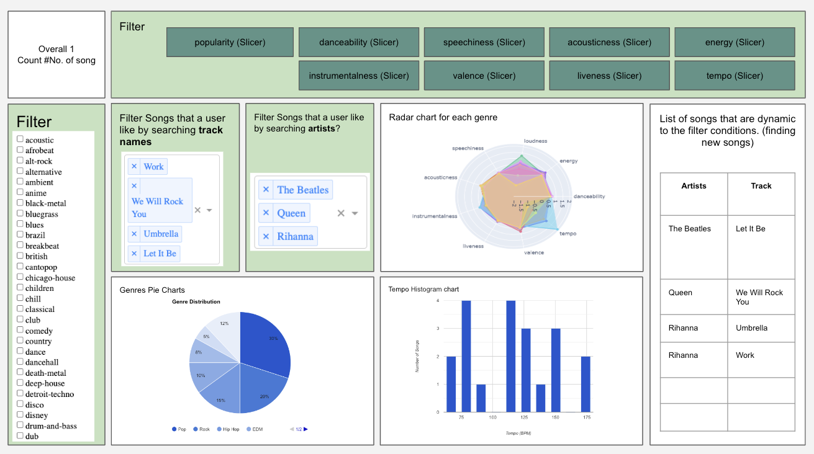

    
    <h1>Discover Your Music Taste Dashboard</h1>

A music exploration tool that uses Spotify data to help users discover new music and understand their listening preferences. It includes a variety of features, such as:  

**Slicers**: These allow users to filter songs based on various attributes, such as popularity, danceability, speechiness, and tempo. This can help users narrow down their search results and find songs that match their specific tastes.  

**Dropdown Filters**: These offer quick and customizable song discovery. Users can directly search for artists and songs via text input.  

**Radar chart**: This visualizes a user's overall music taste based on the different audio features. Each axis represents a different audio feature, and the user's listening habits are plotted as points on the radar chart. This can help users identify their preferred genres and styles of music.  

**Genre pie charts**: These show the distribution of genres in the user's listening history. This can help users see which genres they listen to the most and explore other genres that they may enjoy.  

**Tempo histogram chart**: This shows the distribution of tempos in the user's listening history. This can help users identify their preferred tempos and find songs that match their energy level. 

**List of songs**: This displays a list of songs that match the user's selected filters. This can help users discover new songs that they are likely to enjoy.  

Example sketch:  

  
